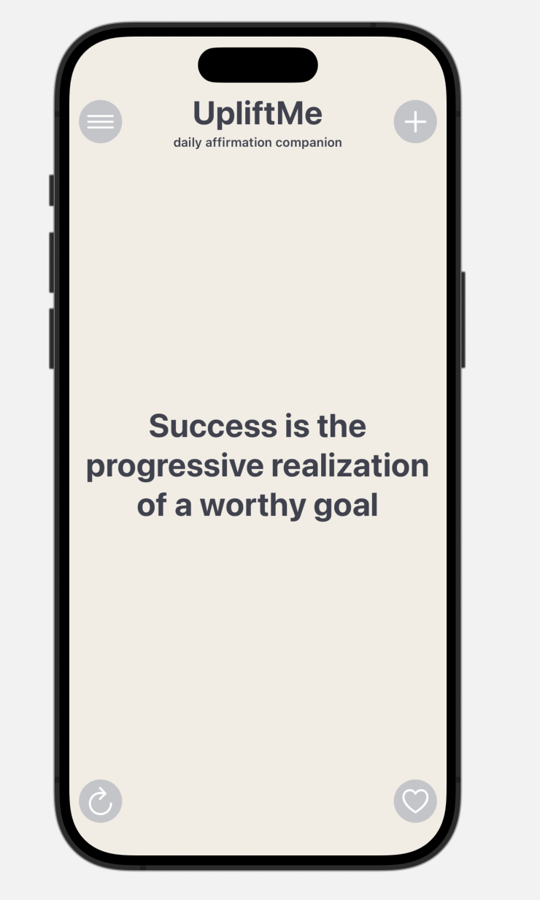
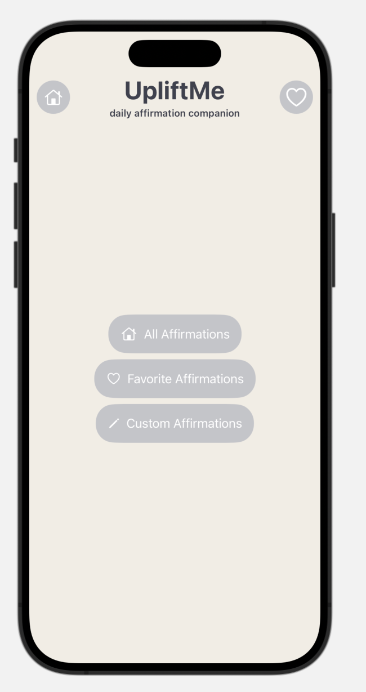
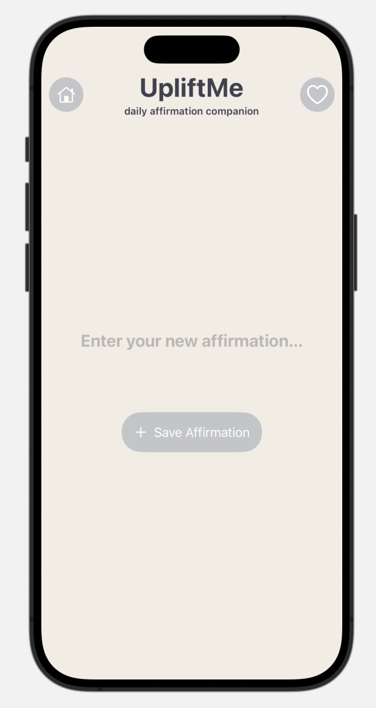
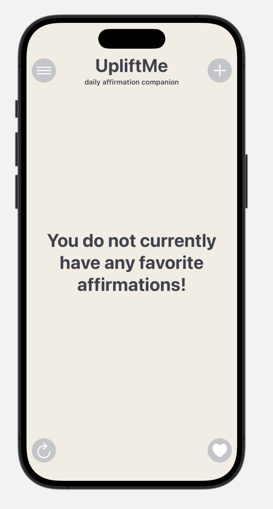

# UpliftMe
Positive Affirmation App

**Overview**

The Positive Affirmation App is a mobile application designed to uplift and inspire users through positive affirmations. This app aims to promote a positive mindset and boost confidence by delivering daily affirmations to users.

**Features**

Daily Affirmations: Receive a new positive affirmation each day and refresh for more.

Customizable Affirmations: Users can customize and save their favorite affirmations.

User-friendly Interface: Intuitive and visually appealing design for a seamless user experience.

## Affirmation API

This app utilizes the [Affirmation API](https://affirmations.dev/) to dynamically fetch positive affirmations. The API provides a variety of affirmations to keep the content fresh and diverse.

**Screenshots**

 

**Future Changes:**

Reminders: Set reminders to receive affirmations at specific times.

Notifications: Receive affirmations as notifications.

**Getting Started**

To run the app locally, follow these steps:

Clone the Repository:
Copy code
git clone git@github.com:syousafz/UpliftMe.git

Open in Xcode:
Open the project in Xcode.
Ensure you have the necessary dependencies installed.

Build and Run:

Build and run the app on a simulator.

**Dependencies**

Swift 5.0+
Xcode 12.0+

**Using the app:**
Upon launching the app, a new affirmation will be displayed.
Customizing Affirmations:
Tap the heart icon to save an affirmation to your favorites.
Click the add button to add your own custom affirmation.
Access your saved affirmations from the Favorites section.
